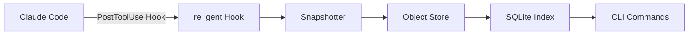

# Additional Issues Based on Roadmap

Issues organized by phase and complexity.

---

## Phase 3: Advanced Features (Current Focus)

### Issue: Implement `rgt fork` command

**Labels:** `enhancement`, `phase-3`, `core`

**Description:**

Implement the `rgt fork` command to create a new session branching from any step. This enables exploring alternative implementations without affecting the original session.

**Acceptance Criteria:**
- [ ] `rgt fork <step-hash>` creates a new session ref at that step
- [ ] New session gets a unique session ID
- [ ] Working directory is updated to match the forked step's tree
- [ ] Command shows the new session ID and instructions
- [ ] Add `--session-name` flag for custom naming (optional)
- [ ] Add tests covering fork scenarios
- [ ] Update documentation

**Example Usage:**
```bash
$ rgt fork a1b2c3d
Forked from step a1b2c3d (2 steps back)
New session: claude-20260509-180421

Your workspace has been restored to step a1b2c3d.
Continue working to explore an alternative approach.
```

**Files to Edit:**
- `internal/cli/fork.go` — New command implementation
- `internal/store/refs.go` — Session creation logic
- `internal/snapshot/restore.go` — Workspace restoration
- Tests

**Technical Notes:**
- Session refs live at `refs/sessions/<session_id>`
- Must use CAS when creating new ref
- See POC.md §9.4 for fork algorithm

**Estimated Time:** 4-6 hours

---

### Issue: Implement `rgt rewind` command (non-destructive)

**Labels:** `enhancement`, `phase-3`, `core`

**Description:**

Implement non-destructive time-travel: restore the workspace and conversation to any previous step without losing the history that came after.

**Acceptance Criteria:**
- [ ] `rgt rewind <step-hash>` restores workspace to that step
- [ ] Original steps remain in the DAG (non-destructive)
- [ ] Session ref is updated to point to the rewound step
- [ ] Conversation/transcript is restored (if possible)
- [ ] Command shows diff of what changed
- [ ] Add `--dry-run` flag to preview changes
- [ ] Add tests covering rewind scenarios
- [ ] Update documentation

**Example Usage:**
```bash
$ rgt rewind d4e5f6g --dry-run
Would rewind 3 steps back to "Added error handling"

Files that will change:
  M  src/handler.go (5 lines)
  D  tests/handler_test.go

$ rgt rewind d4e5f6g
Rewound to step d4e5f6g (3 steps back)
  M  src/handler.go
  D  tests/handler_test.go
```

**Files to Edit:**
- `internal/cli/rewind.go` — New command implementation
- `internal/snapshot/restore.go` — Workspace restoration
- `internal/store/refs.go` — Ref updates with CAS
- Tests

**Technical Notes:**
- Must handle dirty workspace (warn before overwriting)
- Effects (side effects) cannot be undone — log warning
- See POC.md §9.3 for rewind algorithm

**Estimated Time:** 6-8 hours

---

### Issue: Add performance benchmarks for large repositories

**Labels:** `enhancement`, `phase-3`, `performance`, `testing`

**Description:**

Create benchmarks to measure re_gent performance on repositories of varying sizes (100, 1k, 10k, 50k files). Identify bottlenecks in snapshot/hashing logic.

**Acceptance Criteria:**
- [ ] Benchmark suite that tests snapshot performance across repo sizes
- [ ] Measure: initial snapshot, incremental snapshot, blame query, log query
- [ ] Results documented in `docs/PERFORMANCE.md`
- [ ] CI integration to track performance over time (optional)
- [ ] Identify top 3 bottlenecks with recommendations

**Files to Create:**
- `test/benchmark_test.go` — Benchmark suite
- `docs/PERFORMANCE.md` — Results and analysis
- `test/fixtures/` — Generate test repos of various sizes

**Technical Notes:**
- Use Go's built-in benchmarking: `go test -bench=.`
- Generate synthetic repos with `git` or custom script
- Focus on the hot path: snapshot + hash computation

**Estimated Time:** 4-6 hours

---

### Issue: Implement incremental snapshots (optimization)

**Labels:** `enhancement`, `phase-3`, `performance`

**Description:**

Optimize snapshot performance by only re-hashing files that changed since the last step. Use inode metadata (mtime, size) to detect changes.

**Current Behavior:**
Every step re-hashes all files in the workspace (slow for large repos).

**Desired Behavior:**
Check mtime/size from SQLite index. Only re-hash files that changed.

**Acceptance Criteria:**
- [ ] SQLite index stores `(path, mtime, size, hash)` per file
- [ ] Snapshot checks index before hashing
- [ ] Only hash files where mtime or size changed
- [ ] Fallback to full scan if index is missing/corrupt
- [ ] Add benchmark showing speedup (should be 10-100x for large repos)
- [ ] Add tests covering incremental logic
- [ ] Update documentation

**Files to Edit:**
- `internal/snapshot/snapshot.go` — Add incremental logic
- `internal/index/schema.sql` — Add file metadata table
- `internal/index/index.go` — Store/query file metadata
- Tests

**Technical Notes:**
- Watch for edge cases: file replaced with same mtime
- Git uses similar approach with index cache
- See POC.md §11 "Open Design Questions" #4

**Estimated Time:** 6-8 hours

---

## Phase 4: Multi-Tool Support (Planned)

### Issue: Research and document Cursor adapter requirements

**Labels:** `research`, `phase-4`, `adapters`

**Description:**

Research how Cursor stores agent activity and document what we'd need to build a re_gent adapter for it.

**Deliverables:**
- [ ] Document in `docs/adapters/CURSOR.md`:
  - How Cursor tracks tool calls
  - Where logs/transcripts are stored
  - Hook points (if any)
  - Payload format
  - Key differences from Claude Code
- [ ] Estimate effort to build the adapter (small/medium/large)
- [ ] Identify any blockers

**Research Questions:**
- Does Cursor have hooks like Claude Code?
- What's the format of their logs?
- How do they track sessions?
- Can we passively read their logs, or do we need to inject?

**Estimated Time:** 2-3 hours

---

### Issue: Research and document Cline adapter requirements

**Labels:** `research`, `phase-4`, `adapters`

**Description:**

Research Cline's (formerly Claude-dev) architecture and document adapter requirements.

**Deliverables:**
- [ ] Document in `docs/adapters/CLINE.md`:
  - How Cline tracks tool calls
  - Where logs/transcripts are stored
  - Hook points (if any)
  - Payload format
  - Key differences from Claude Code
- [ ] Estimate effort to build the adapter
- [ ] Identify any blockers

**Technical Notes:**
- Cline is open source: https://github.com/cline/cline
- VS Code extension, may have similar architecture to Claude Code
- Check if they expose hooks or if we need to fork

**Estimated Time:** 2-3 hours

---

### Issue: Research and document Aider adapter requirements

**Labels:** `research`, `phase-4`, `adapters`

**Description:**

Research Aider's architecture and document adapter requirements.

**Deliverables:**
- [ ] Document in `docs/adapters/AIDER.md`:
  - How Aider tracks commands/changes
  - Where logs are stored
  - Hook points (if any)
  - Payload format
  - Key differences from Claude Code
- [ ] Estimate effort to build the adapter
- [ ] Identify any blockers

**Technical Notes:**
- Aider is CLI-based: https://github.com/paul-gauthier/aider
- May need to patch their source or run as wrapper
- Git integration already exists — see if we can hook into that

**Estimated Time:** 2-3 hours

---

## Documentation & Examples

### Issue: Create `examples/concurrent-sessions` demo

**Labels:** `documentation`, `examples`

**Description:**

Create an example showing two Claude Code sessions working in parallel on the same project, demonstrating how re_gent tracks them independently.

**What to Create:**
- `examples/concurrent-sessions/README.md` — Step-by-step walkthrough
- `examples/concurrent-sessions/setup.sh` — Script to simulate scenario
- Sample files demonstrating the scenario

**Scenario:**
- Session 1: Refactoring the API handler
- Session 2: Adding tests
- Show how `rgt log --session <id>` filters by session
- Show how `rgt sessions` lists both
- Demonstrate conflict detection (if both touch same file)

**Estimated Time:** 2-3 hours

---

### Issue: Add architecture diagram to CLAUDE.md

**Labels:** `documentation`, `good first issue`

**Description:**

Create a visual diagram showing re_gent's architecture and add it to CLAUDE.md.

**What to Create:**
Using mermaid.js or ASCII art, create a diagram showing:
- File System → Hook → Snapshotter → Object Store
- Object Store → SQLite Index
- SQLite Index → CLI (log/blame/show)

**Acceptance Criteria:**
- [ ] Diagram is clear and accurate
- [ ] Added to CLAUDE.md under "Conceptual Model" or "Architecture"
- [ ] Shows the data flow for a tool call
- [ ] Shows the relationship between objects (Blob, Tree, Step, Ref)

**Example (mermaid.js):**


**Estimated Time:** 1-2 hours

---

### Issue: Write testing guide for contributors

**Labels:** `documentation`, `testing`

**Description:**

Expand TESTING.md with practical examples and patterns for writing tests in re_gent.

**What to Add:**
- [ ] How to write a unit test for a new command
- [ ] How to write an integration test
- [ ] How to use test fixtures
- [ ] How to mock the object store
- [ ] Example of table-driven test
- [ ] How to run tests in isolation
- [ ] Debugging tips

**Files to Edit:**
- `TESTING.md` — Add new sections with examples

**Estimated Time:** 2-3 hours

---

## Testing & Quality

### Issue: Add race detector to CI

**Labels:** `testing`, `ci`

**Description:**

Add a CI job that runs tests with the race detector to catch concurrency bugs.

**Acceptance Criteria:**
- [ ] New CI job in `.github/workflows/ci.yml`
- [ ] Runs `go test -race ./...`
- [ ] Fails the build if races are detected
- [ ] Badge in README showing race detector status (optional)

**Files to Edit:**
- `.github/workflows/ci.yml`

**Technical Notes:**
- Race detector can be slow, so run in parallel with normal tests
- May need to increase timeout for race detector run

**Estimated Time:** 30 minutes - 1 hour

---

### Issue: Add code coverage reporting to CI

**Labels:** `testing`, `ci`, `good first issue`

**Description:**

Add code coverage tracking to CI and display a badge in README.

**Acceptance Criteria:**
- [ ] CI generates coverage report: `go test -cover ./...`
- [ ] Upload to coverage service (codecov.io or coveralls.io)
- [ ] Badge in README showing coverage %
- [ ] Coverage report accessible via link

**Files to Edit:**
- `.github/workflows/ci.yml`
- `README.md` — Add badge

**Estimated Time:** 1-2 hours

---

### Issue: Add end-to-end test: Full Claude Code session simulation

**Labels:** `testing`, `integration`

**Description:**

Create an end-to-end test that simulates a full Claude Code session with multiple tool calls, then validates the re_gent state.

**Test Scenario:**
1. Initialize `.regent/`
2. Simulate 5 tool calls: Write, Edit, Bash, Write, Edit
3. Validate:
   - 5 steps created
   - Session ref points to latest step
   - `rgt log` output is correct
   - `rgt blame` returns correct step for each line
   - Conversation is captured

**Acceptance Criteria:**
- [ ] Test in `test/e2e_test.go`
- [ ] Uses mock hook payloads (don't need real Claude Code)
- [ ] Validates full system behavior
- [ ] Runs in < 1 second

**Estimated Time:** 3-4 hours

---

## Polish & UX

### Issue: Add shell completion for step hashes

**Labels:** `enhancement`, `ux`, `good first issue`

**Description:**

Improve shell completion to suggest step hashes when running `rgt show <tab>`, `rgt rewind <tab>`, etc.

**Current Behavior:**
No completion for step arguments.

**Desired Behavior:**
Tab completion suggests recent step hashes from the current session.

**Acceptance Criteria:**
- [ ] Completion for `rgt show` suggests step hashes
- [ ] Completion for `rgt fork` suggests step hashes (when implemented)
- [ ] Completion for `rgt rewind` suggests step hashes (when implemented)
- [ ] Works in bash, zsh, fish
- [ ] Update `docs/shell-completion.md`

**Files to Edit:**
- `cmd/rgt/main.go` or completion generation logic
- `completions/` directory

**Technical Notes:**
- Cobra has built-in completion support
- May need to query SQLite for recent steps
- See: https://github.com/spf13/cobra/blob/main/shell_completions.md

**Estimated Time:** 2-3 hours

---

### Issue: Colorize `rgt log` output for better readability

**Labels:** `enhancement`, `ux`

**Description:**

Add color to `rgt log` output to make it easier to scan (while respecting `NO_COLOR` env var).

**Current Behavior:**
Plain text output.

**Desired Behavior:**
- Step hash: bold
- Timestamp: dim gray
- Tool name: colored based on type (Edit=yellow, Write=green, Bash=blue)
- File paths: underlined
- Diff stats: +/- colored (green/red)

**Acceptance Criteria:**
- [ ] Colors improve readability in both dark and light terminals
- [ ] Respects `NO_COLOR` environment variable
- [ ] Respects `--no-color` flag
- [ ] Follows [BRAND.md](../BRAND.md) color guidelines
- [ ] Add screenshots to PR showing before/after

**Files to Edit:**
- `internal/cli/log.go`
- Use existing `internal/style/` package

**Technical Notes:**
- Already using aurora for colors in other commands
- Test in both light and dark terminal themes

**Estimated Time:** 2-3 hours

---

## Advanced Features

### Issue: Add `rgt diff <step1> <step2>` command

**Labels:** `enhancement`, `feature`

**Description:**

Add a command to show the diff between two steps (like `git diff`).

**Usage:**
```bash
# Show changes between two steps
$ rgt diff a1b2c3d d4e5f6g

# Show changes from step to current workspace
$ rgt diff a1b2c3d
```

**Acceptance Criteria:**
- [ ] `rgt diff <step1> <step2>` shows file-level and line-level diffs
- [ ] `rgt diff <step>` compares step to current workspace
- [ ] Output uses unified diff format
- [ ] Add `--name-only` flag (like git)
- [ ] Add `--stat` flag for summary
- [ ] Add tests
- [ ] Update documentation

**Files to Create:**
- `internal/cli/diff.go`

**Files to Edit:**
- `internal/diff/` — May need to enhance diff logic

**Estimated Time:** 4-5 hours

---

### Issue: Add `rgt gc` command for garbage collection

**Labels:** `enhancement`, `phase-5`, `advanced`

**Description:**

Implement garbage collection to remove unreachable objects (orphaned steps, abandoned branches).

**Acceptance Criteria:**
- [ ] `rgt gc` finds and removes unreachable objects
- [ ] Preserves all objects reachable from session refs
- [ ] Add `--dry-run` flag to preview what would be deleted
- [ ] Show space savings after GC
- [ ] Add grace period (don't delete recent orphans)
- [ ] Add tests
- [ ] Update documentation

**Technical Notes:**
- Similar to `git gc`
- Mark-and-sweep: mark all reachable from refs, sweep unreachable
- See POC.md §11 Open Design Question #5

**Estimated Time:** 6-8 hours

---
