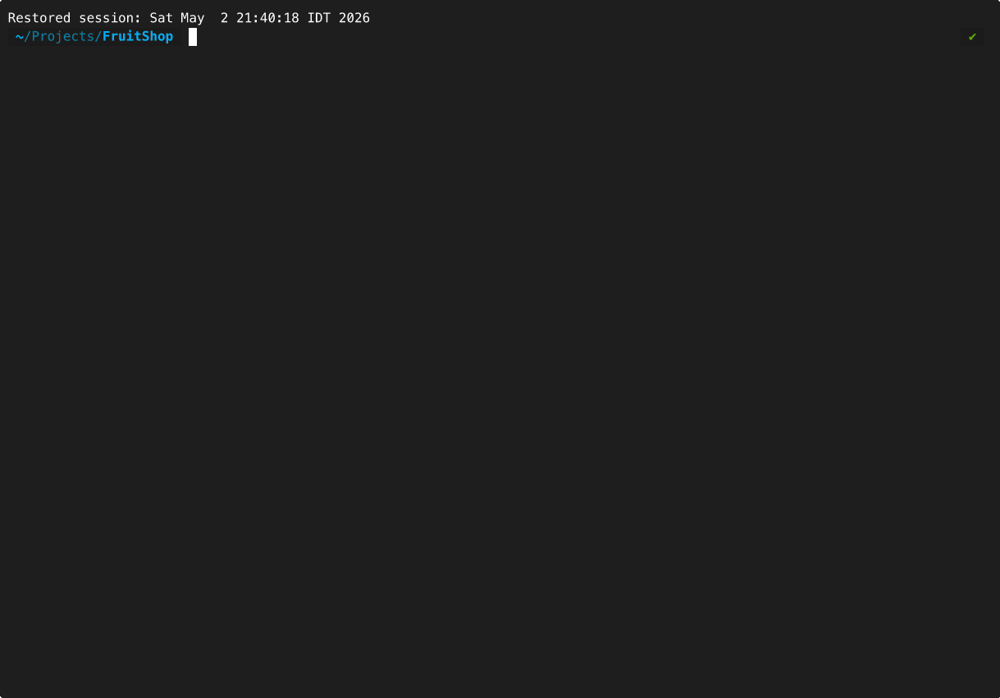

<div align="center">
  <a href="https://github.com/regent-vcs/regent">
    
  </a>
  <br />
  <br />
  <h1>Git for AI Agents</h1>
  <p>
    <em>We gave agents write access to our codebases.<br/>We did not give ourselves git for it.</em>
  </p>

[](CONTRIBUTING.md) [](go.mod) [](LICENSE)

  <br />
</div>

---

## The Problem

You know this pain:
- *"It was working five minutes ago"*
- *"Go back to before the refactor"*
- *"Why did you change that file?"*
- `/compact` and pray
- Copy-pasting code into a fresh chat
- Screenshotting the "good" version

**AI agents have no version control of their own.**

---

## The Solution

Regent gives you three primitives that should already exist:

### 🔍 **blame** — which prompt wrote this line?
```bash
$ rgt blame src/handler.go:42
Line 42: func handleRequest(w http.ResponseWriter, r *http.Request) {
│
├─ Step: a1b2c3d4
├─ Session: claude-20260502-143021
├─ Tool: Edit
└─ Prompt: "Add error handling to the request handler"
```

### 📜 **log** — what did this session actually do?
```bash
$ rgt log
Step a1b2c3d  |  2 min ago  |  Tool: Edit
│ File: src/handler.go
│ Added error handling
│ + 5 lines, - 2 lines

Step d4e5f6g  |  5 min ago  |  Tool: Write
│ File: tests/handler_test.go
│ Created unit tests
│ + 23 lines
```

### ⏪ **rewind** — restore to step N (coming soon)
```bash
$ rgt rewind a1b2c3d
✓ Restored workspace to step a1b2c3d
✓ Session ref moved backward
✓ Audit trail intact (non-destructive)
```

---

## Demo

<div align="center">
  
  <p><em>Regent automatically captures every tool call your agent makes</em></p>
</div>

**No manual commits.** Hooks into Claude Code, tracks everything transparently.

---

## Quick Start

### Installation

```bash
# Install via Go
go install github.com/regent-vcs/regent/cmd/rgt@latest

# Or build from source
git clone https://github.com/regent-vcs/regent
cd regent
go build -o rgt ./cmd/rgt
```

### Usage

```bash
# 1. Initialize in your project
cd your-project
rgt init
# Press Y when prompted to enable Claude Code hook

# 2. Work with Claude Code normally
# (every Edit, Write, Bash is automatically tracked)

# 3. Explore what happened
rgt log              # See step history
rgt sessions         # List active sessions
rgt show <step>      # View full context
```

That's it. Every agent action is now auditable.

---

## How It Works

Regent stores agent activity in `.regent/` (like `.git/`):

```
.regent/
├── objects/     # Content-addressed blobs (BLAKE3)
├── refs/        # Session pointers (one per agent)
├── index.db     # SQLite query index
└── config.toml
```

Every tool call creates a **Step**:

```go
Step {
  parent:      <previous-step-hash>
  tree:        <workspace-snapshot>
  transcript:  <conversation-delta>
  cause: {
    tool_name: "Edit"
    args:      <what-changed>
    result:    <tool-output>
  }
  session_id:  "claude-20260502-143021"
  timestamp:   "2026-05-02T14:30:21Z"
}
```

Steps form a **DAG**. Each session has its own branch. Common ancestors dedupe. You get git-level auditability for AI activity.

---

## Regent vs Git

| | Git | Regent |
|---|---|---|
| **Tracks code** | ✅ | ✅ |
| **Tracks agent activity** | ❌ | ✅ |
| **Blame with prompt** | ❌ | ✅ |
| **Conversation history** | ❌ | ✅ |
| **Concurrent sessions** | ⚠️ conflicts | ✅ separate branches |
| **Purpose** | Developer VCS | Agent audit trail |

**Regent complements git, doesn't replace it.** Use both.

---

## Features

- 👑 **Content-Addressed Storage** — BLAKE3, automatic deduplication
- ⚡ **Fast Queries** — SQLite index, sub-10ms lookups
- 📊 **Per-Session DAG** — Concurrent agents, no conflicts
- 💬 **Conversation Tracking** — Survives `/compact` and `/clear`
- 🪝 **Hook-Driven** — Transparent Claude Code integration
- 🔒 **Concurrency-Safe** — CAS refs, ACID transactions
- 🎯 **Gitignore-Compatible** — `.regentignore` support

---

## Commands

**Available Now:**
- `rgt init` — Initialize `.regent/`
- `rgt log` — Show step history
- `rgt sessions` — List active sessions
- `rgt status` — Current state
- `rgt show <step>` — Full step details

**Coming Soon:**
- `rgt blame <path>:<line>` — Per-line provenance (Phase 3)
- `rgt rewind <step>` — Non-destructive time-travel (Phase 5)
- `rgt gc` — Garbage collection (Phase 6)

See [POC.md](POC.md) for the complete technical specification.

---

## Roadmap

- ✅ **Phase 1:** Object store (blob, tree, step, ref)
- ✅ **Phase 2:** Hook integration (Claude Code)
- 🚧 **Phase 3:** Blame algorithm (Myers diff)
- 📋 **Phase 4:** Transcript capture (JSONL)
- 📋 **Phase 5:** Rewind (time-travel)
- 📋 **Phase 6:** Concurrency hardening

Check [GitHub Projects](https://github.com/regent-vcs/regent/projects) for current priorities.

---

## Why This Matters

AI agents are getting more autonomous. They fix their own code, operate in production, generate real business value.

**But autonomy without auditability is chaos.**

You need to answer:
- *"What changed?"* → `rgt log`
- *"Why?"* → `rgt blame`
- *"Can I undo it?"* → `rgt rewind`

Regent is the infrastructure layer that makes agent activity **inspectable, reversible, and shareable.**

---

## Status

**Active Development (POC Stage)**

- ~4.5k LOC Go implementation
- Core functionality works (Phases 1-2 complete)
- Used in production by contributors
- Not yet v1.0 (see roadmap)

**Honest assessment:** This is production-quality code at POC-level feature completeness. We're building in public. Contributions welcome.

---

## Contributing

We use [GitHub Flow](https://guides.github.com/introduction/flow). Create a branch, add commits, [open a PR](https://github.com/regent-vcs/regent/compare).

Read [CONTRIBUTING.md](CONTRIBUTING.md) for details.

**Before opening a PR:**
- [ ] Tests pass (`go test ./...`)
- [ ] Code formatted (`gofmt -w .`)
- [ ] Read [BRAND.md](BRAND.md) if touching CLI output

---

## Built With

- [cobra](https://github.com/spf13/cobra) — CLI framework
- [blake3](https://lukechampine.com/blake3) — BLAKE3 hashing
- [go-diff](https://github.com/sergi/go-diff) — Myers diff
- [modernc.org/sqlite](https://modernc.org/sqlite) — Pure Go SQLite

---

## License

[Apache License 2.0](LICENSE)

---

<div align="center">
  <p>
    <sub>Built with ❤︎ by <a href="https://github.com/regent-vcs/regent/graphs/contributors">contributors</a></sub>
  </p>
  <p>
    <a href="https://github.com/regent-vcs/regent/discussions">💬 Discussions</a> •
    <a href="https://github.com/regent-vcs/regent/issues">🐛 Issues</a> •
    <a href="POC.md">📖 Technical Spec</a>
  </p>
</div>
