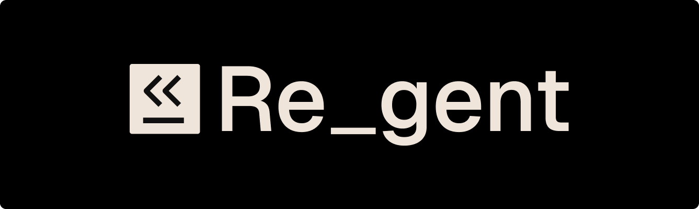

<div align="center">
  <a href="https://github.com/regent-vcs/regent">
    
  </a>
  <br />
  <br />
  <b>
    Git for AI Agents
  </b>
  <p>

[](CONTRIBUTING.md) [](https://github.com/regent-vcs/regent/actions) [](go.mod) [](LICENSE)

  </p>
  <p>
    <sub>
      Built with ❤︎ by
      <a href="https://github.com/regent-vcs/regent/graphs/contributors">
        contributors
      </a>
    </sub>
  </p>
  <br />
  <!-- TODO: Add banner images when ready
  <p>
    <a href="https://github.com/regent-vcs/regent">
      <picture>
        <source media="(prefers-color-scheme: dark)" srcset="assets/banner-dark.png">
        <source media="(prefers-color-scheme: light)" srcset="assets/banner-light.png">
        
      </picture>
    </a>
  </p>
  -->
</div>

_Version control for AI agent activity. Regent captures what an agent did, why, and lets you blame, log, and rewind across sessions._

_We highly recommend you take a look at the [**Technical Specification**](POC.md) to learn more about the architecture._

#### **Support**

[](https://github.com/regent-vcs/regent/discussions) [](https://github.com/regent-vcs/regent/issues)

### **Features**

👑 **Content-Addressed Storage:** BLAKE3 hashing with automatic deduplication — identical content stores once.

⚡️ **Fast Queries:** SQLite-powered index for sub-10ms blame lookups and instant log filtering.

📊 **Per-Session DAG:** Each agent session maintains its own branch with shared ancestry.

- Concurrent sessions work independently
- Common ancestors dedupe automatically
- Sub-agents get their own chains with merge points
- Non-destructive history — never lose exploration paths

🔍 **Blame with Provenance:** Per-line attribution showing which prompt produced each line of code.

- Computed at write time (O(1) queries)
- Annotated blame maps stored alongside trees
- `rgt blame <path>:<line>` shows the exact step and cause

⏪ **Non-Destructive Rewind:** Time-travel to any previous step without losing work.

- Move session ref backward
- Optionally restore workspace files
- Abandoned branches remain in object store
- Audit trail stays intact

💬 **Conversation Tracking:** Transcripts stored as content-addressed, chained delta objects.

- Resilient to `/compact` and `/clear`
- Reconstruct full conversation at any step
- Message-level deduplication across sessions

🪝 **Hook-Driven Capture:** Transparent integration via agent tool hooks.

- **Claude Code** via `PostToolUse` hook ✅
- **Cursor, Cline, Continue** — adapters planned
- **Claude Agent SDK** — native support planned
- Zero-overhead when inactive

📦 **Immutable Objects:** Blobs, trees, and steps are write-once.

- Trees: `{ path → (blob_hash, blame_hash, mode) }`
- Steps: `{ parent, tree, transcript, cause, session_id, ... }`
- Blobs: raw bytes identified by `blake3(content)`

🔒 **Concurrency-Safe Refs:** CAS-based updates prevent lost updates.

- Multiple sessions can write simultaneously
- Optimistic concurrency with retry
- Session isolation at ref level

🎯 **Ignore Patterns:** `.regentignore` with gitignore-compatible syntax.

- Skip `node_modules`, `.git`, build artifacts
- Respects `.gitignore` by default
- Per-project customization

📈 **Queryable History:** Filter by session, time range, file path.

- `rgt log --session <id>`
- `rgt log --since "2 hours ago"`
- `rgt log -- path/to/file`
- JSON output for scripting (`--json`)

🔧 **CLI-First Design:** Single static binary, no dependencies.

- `rgt init` — Initialize `.regent/` in your project
- `rgt status` — Show current sessions and state
- `rgt log` — Display step history with filtering
- `rgt blame <path>` — Per-line provenance
- `rgt rewind <step>` — Time-travel to previous state
- `rgt sessions` — List all active sessions

_Follows [Brand Guidelines](BRAND.md) — purple accent, semantic colors, respects `NO_COLOR`._

**For a complete list of features, please read our [POC.md](POC.md).**

## **Demo**

<!-- TODO: Add animated GIF showing: rgt init → edit files → rgt log → rgt blame -->
*Coming soon: Screencast of `rgt` in action with Claude Code*

## **Installation**

### **From Source** (Current)

```bash
# Clone and build
git clone https://github.com/regent-vcs/regent
cd regent
go build -o rgt ./cmd/rgt

# Or install directly via Go
go install github.com/regent-vcs/regent/cmd/rgt@latest
```

### **Coming Soon**
- **Homebrew:** `brew install regent-vcs/tap/rgt`
- **Prebuilt Binaries:** [GitHub Releases](https://github.com/regent-vcs/regent/releases)
- **Package Managers:** `apt`, `yum`, `pacman`

## **Usage**

1. **Initialize** Regent in your project

   ```bash
   cd your-project
   rgt init
   ```

   _When prompted: "Enable automatic tracking in Claude Code? [Y/n]" — press Y (or Enter for default yes)_

2. **Work normally** with your AI agent (Claude Code, etc.)

   Every tool call is automatically tracked as a Step in `.regent/`

3. **Explore your history**

   ```bash
   # View step history
   rgt log

   # Filter by session
   rgt log --session abc123

   # Check current status
   rgt status

   # See who/what changed a line
   rgt blame src/main.go:42
   ```

## **How It Works**

Regent stores agent activity in a `.regent/` directory (analogous to `.git/`):

```
.regent/
├── objects/        # Content-addressed blobs (trees, steps, files, messages)
├── refs/           # Mutable pointers to current step (one per session)
│   └── sessions/
├── index.db        # SQLite derived index for fast queries
└── config.toml     # Project configuration
```

Every tool call creates a **Step** (similar to a git commit, but auto-generated):

```
Step {
  parent:       <previous-step-hash>
  tree:         <workspace-snapshot-hash>
  transcript:   <conversation-delta-hash>
  cause: {
    tool_name:  "Edit"
    args_blob:  <hash-of-args>
    result_blob: <hash-of-result>
  }
  session_id:   "abc123..."
  timestamp:    "2026-04-30T12:34:56Z"
}
```

**The magic:** Steps form a DAG through parent pointers. Each session has its own ref (branch). Common ancestors dedupe. You get git-level auditability for agent activity.

## **Regent vs Git**

| Feature | Git | Regent |
|---------|-----|--------|
| Tracks code changes | ✅ | ✅ |
| Tracks agent activity | ❌ | ✅ |
| Per-line blame with prompt | ❌ | ✅ |
| Rewind/time-travel | ✅ (`reset --hard`) | ✅ (per-session, non-destructive) |
| Conversation history | ❌ | ✅ (content-addressed transcripts) |
| Concurrent sessions | ⚠️ (conflicts) | ✅ (separate branches) |
| **Purpose** | Developer version control | AI agent activity tracking |

**Regent complements git, it doesn't replace it.** Use git for your codebase, Regent for agent activity.

## **Commands**

<details>
  <summary><b>Available Now</b></summary>

---

| Command | Description |
|---------|-------------|
| `rgt init` | Initialize `.regent/` in current directory |
| `rgt status` | Show sessions and current state |
| `rgt log [--session ID] [-n N]` | Display step history with filtering |
| `rgt sessions` | List all sessions |
| `rgt cat <hash>` | Inspect any object by hash (debug) |
| `rgt hook` | Hook entry point for agent integrations |

---

</details>

<details>
  <summary><b>Coming Soon</b></summary>

---

| Command | Phase | Description |
|---------|-------|-------------|
| `rgt blame <path>:<line>` | Phase 3 | Per-line provenance (which step/prompt) |
| `rgt show <step>` | Phase 4 | Display step with full conversation context |
| `rgt rewind <step>` | Phase 5 | Time-travel to previous state |
| `rgt gc` | Phase 6 | Garbage collect orphaned objects |

---

</details>

## **Roadmap**

Regent is being built in phases per [POC.md](POC.md):

- ✅ **Phase 1:** Object store skeleton (blob, tree, step, ref, index)
- ✅ **Phase 2:** Hook integration (Claude Code `PostToolUse`)
- 🚧 **Phase 3:** Blame algorithm (per-line provenance with Myers diff)
- 📋 **Phase 4:** Transcript staging (conversation capture from JSONL)
- 📋 **Phase 5:** Rewind (non-destructive time-travel)
- 📋 **Phase 6:** Concurrency hardening (stress tests, performance validation)

Check the [GitHub Projects board](https://github.com/regent-vcs/regent/projects) for current priorities.

## **Developing**

Follow our [CONTRIBUTING.md](CONTRIBUTING.md) guide to get started with the development environment.

### **Testing**

```bash
# Run all tests
go test ./...

# With race detector
go test -race ./...

# Specific package
go test -v ./internal/store -run TestBlob

# Coverage report
go test -cover ./...
```

See [TESTING.md](TESTING.md) for the full testing strategy and phase-specific requirements.

### **Project Structure**

```
regent/
├── cmd/rgt/              # CLI entry point (main.go)
├── internal/
│   ├── store/           # Object storage (blob, tree, step, ref)
│   ├── snapshot/        # Workspace → tree conversion
│   ├── index/           # SQLite derived index
│   ├── ignore/          # .regentignore parser
│   ├── hook/            # Agent integration adapters
│   └── cli/             # Command implementations
└── test/                # Integration tests
```

### **Built With**

- [cobra](https://github.com/spf13/cobra) — CLI framework
- [blake3](https://lukechampine.com/blake3) — BLAKE3 hashing
- [go-diff](https://github.com/sergi/go-diff) — Myers diff algorithm
- [go-gitignore](https://github.com/sabhiram/go-gitignore) — Ignore pattern matching
- [modernc.org/sqlite](https://modernc.org/sqlite) — Pure Go SQLite (no CGO)

## **Contributing**

Please contribute using [GitHub Flow](https://guides.github.com/introduction/flow). Create a branch, add commits, and [open a pull request](https://github.com/regent-vcs/regent/compare).

Please read [`CONTRIBUTING.md`](CONTRIBUTING.md) for details on our [`CODE OF CONDUCT`](CODE_OF_CONDUCT.md), and the process for submitting pull requests to us.

**Before opening a PR:**

- [ ] Read [BRAND.md](BRAND.md) if touching user-facing output
- [ ] Tests pass locally (`go test ./...`)
- [ ] Code is formatted (`gofmt -w .`)
- [ ] Commit messages follow [Conventional Commits](https://www.conventionalcommits.org/)

## **Continuous Integration**

We use [GitHub Actions](https://github.com/features/actions) for continuous integration. Check out our [build workflows](https://github.com/regent-vcs/regent/actions).

## **Authors**

This project owes its existence to the collective efforts of all those who contribute — [contribute now](CONTRIBUTING.md).

<div align="center">
  <a href="https://github.com/regent-vcs/regent/graphs/contributors">
    
  </a>
</div>

## **License**

This project is licensed under the [Apache License 2.0](https://opensource.org/licenses/Apache-2.0) — see the [`LICENSE`](LICENSE) file for details.
